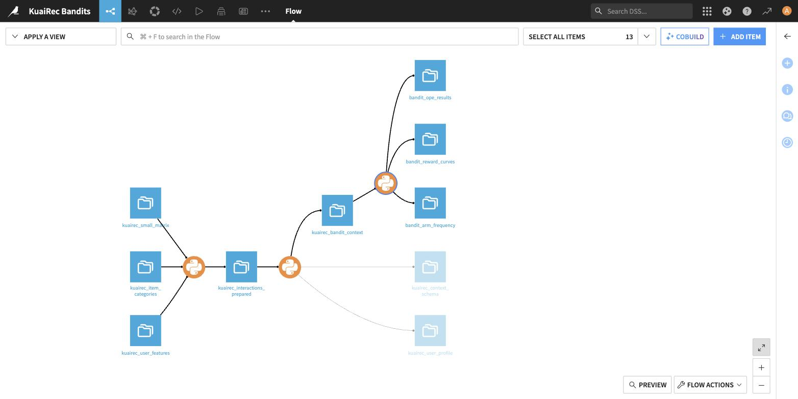
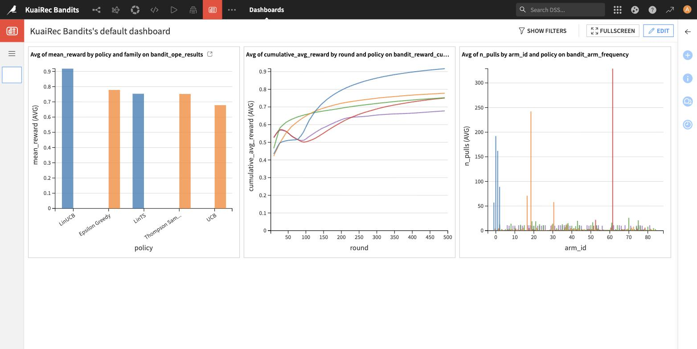
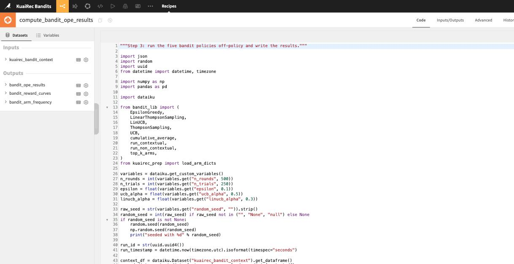
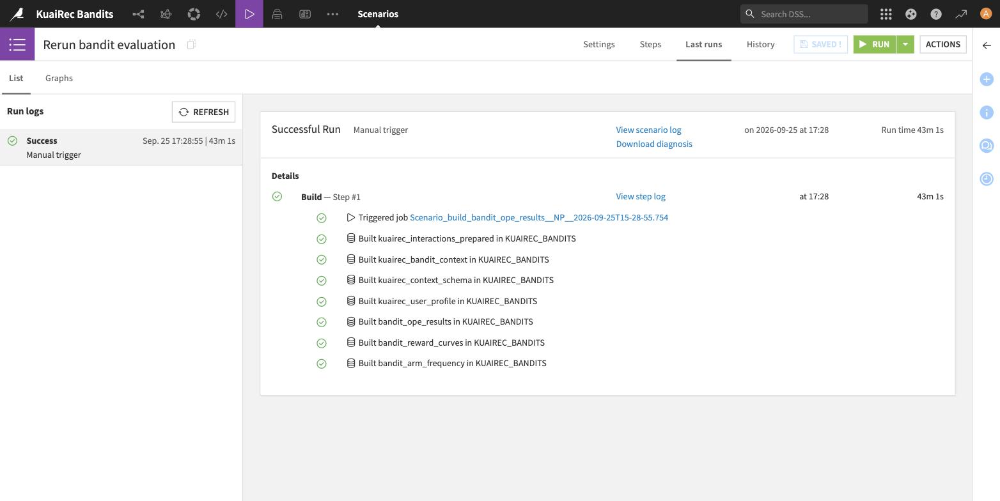

# Multi-Armed Bandits for Personalized Recommendation on Dataiku DSS

Contextual and non-contextual bandit algorithms applied to the
[KuaiRec](https://kuairec.com) short-video recommendation dataset, with
off-policy evaluation against logged user/video/watch-ratio interactions.

Originally an INF581 (École Polytechnique) RL project of Python scripts; now
also **ported to a Dataiku DSS Flow**: three Python recipes, a scenario and a
dashboard, with the evaluation logic and its results unchanged.



## Results

500 rounds × 250 trials, 85 arms, 26-dimensional context, off-policy on logged
KuaiRec interactions:

| Policy | Family | Mean reward | Std |
|---|---|:--:|:--:|
| **LinUCB** (disjoint) | contextual | **0.9180** | 0.2744 |
| ε-greedy | non-contextual | 0.7783 | 0.4154 |
| Linear Thompson Sampling | contextual | 0.7533 | 0.4311 |
| Thompson Sampling (Beta) | non-contextual | 0.7520 | 0.4319 |
| UCB1 | non-contextual | 0.6784 | 0.4671 |

The contextual learner wins clearly. Watch-ratio is thresholded into a
Bernoulli reward (`reward = 1` if the user watched more than 80% of the video);
at each round the learner picks an arm (and, contextually, a context for that
arm) and a logged reward for that arm is read back from the interaction data.
No counterfactual model.



*Left: mean reward per policy, coloured by family. Middle: cumulative average
reward over 500 rounds. Right: arm-selection frequency, showing that each
policy converges hard onto a handful of videos.*

## The Dataiku port

| Step | Recipe | Builds |
|---|---|---|
| 1. Data preparation | `compute_kuairec_interactions_prepared.py` | joins the interaction log to the user table and the item-category table, sub-samples, drops leakage columns |
| 2. Feature engineering | `compute_kuairec_bandit_context.py` | Bernoulli reward + per-arm context matrix, as a long `(arm_id, ctx_index)` dataset |
| 3. Evaluation | `compute_bandit_ope_results.py` | runs all five policies off-policy, writes results / reward curves / arm frequencies |
| 4. Scenario | `Rerun bandit evaluation` | force-rebuilds the whole branch; drives the dashboard |

Recipes import the policies from a DSS **project library** (`bandit_lib`), which
is a byte-identical copy of `src/bandits/`, so the Flow runs the same code the
scripts do.




**→ [`dataiku_dss/README.md`](dataiku_dss/README.md)** is the full step-by-step
guide to rebuilding the Flow in the DSS UI, including the parts that are easy to
get wrong (column types on CSV filesystem datasets will silently change your
results if you skip type inference).

`dataiku_dss/KUAIREC_BANDITS-project.zip` is an exportable DSS project bundle
(recipes, scenario, dashboard, library, dataset definitions; no data).
Import it via **+ New Project > Import project**.

## Project structure

```
mab_bandits/
├── src/                          the original library
│   ├── data_loader.py            KuaiRec loading, sub-sampling, reward / context dicts
│   ├── evaluation.py             off-policy evaluation harness, top-K helpers
│   ├── plots.py                  arm frequency, cumulative reward curves
│   └── bandits/                  Bandit ABCs + the five policies
├── scripts/                      CLI entry points (run_non_contextual, run_contextual, compare_all)
├── dataiku_dss/                  the DSS port
│   ├── README.md                 step-by-step Flow build
│   ├── python-lib/               goes into the DSS project library
│   ├── recipes/                  the three Python recipes
│   ├── scenarios/                scenario script
│   └── screenshots/
├── report/                       original INF581 report (Amazon Sales dataset)
├── data/                         KuaiRec CSVs (not committed, see data/README.md)
└── results/                      generated plots
```

## Algorithms

| Family | Algorithm |
|---|---|
| Non-contextual | ε-greedy, UCB1, Thompson Sampling (Beta) |
| Contextual | LinUCB (disjoint), Linear Thompson Sampling |

## Run it as scripts

```bash
pip install -r requirements.txt
# put KuaiRec CSVs in data/ (see data/README.md)

python scripts/run_non_contextual.py --rounds 500 --trials 250
python scripts/run_contextual.py --rounds 500 --trials 250 --alpha 0.3
python scripts/compare_all.py
```

## Report, and how the project evolved

`report/INF581_Team_Project_Report.pdf` is the original INF581 team report. It
studies the **same algorithms on a different dataset**: Amazon Sales, roughly
1,000 products, with ratings as the reward signal.

The work in this repository is the continuation of that report, and it closes
the limitation the report ends on. Page 3 notes that "the context was generated
randomly in the case of LinUCB", and that "further studies will consider a real
context including user features".

That is what changed here:

| | Report (Amazon Sales) | This repository (KuaiRec) |
|---|---|---|
| Scale | ~1,000 products | 4.7M logged interactions |
| Context | randomly generated | 26 real user features per interaction |
| Reward | product rating, with a dynamic explorer-score adjustment | `watch_ratio > 0.8`, Bernoulli |
| User features | absent, derived via SVD | present in the dataset |
| Evaluation | simulated user interactions | off-policy replay of a real log |

So the contextual results here rest on genuine user context rather than
synthetic signal, which is the comparison the report wanted to make and could
not. One idea did carry over: the report's "explorer score", a measure of how much
a user tends to explore, reappears as `exp_score_generator` and the
`kuairec_user_profile` dataset, recomputed from video tags instead of product
purchases.

Read the report for the framing, the algorithm derivations and the background;
read this repository for the results on real context.
